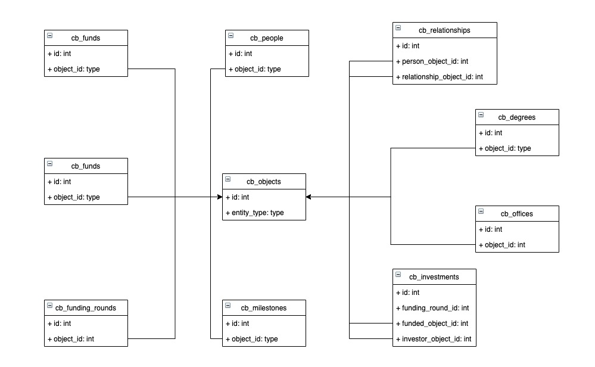

# Crunchbase 2013

2014 年之前 crunchbase 收集到的各种公司、主要人物、以及投资事件之间的关系数据，其中涉及人物 226,708 个、公司 196,553 家、金融机构 11,652 家以及产品 27,738 个。

## 数据来源

本数据库可以直接从 crunchbase 的 [网站](https://data.crunchbase.com/docs/2013-snapshot) 上下载得到，需要注册账号，并等待官方邮件回复 user_key。我申请时大概等待半个工作日。

## 数据模型



具体每张表的内容描述如下：

| 表名                  | 数据释义                                             |
| --------------------- | ---------------------------------------------------- |
| cb_acquisitions       | 公司收购事件信息                                     |
| cb_people, cb_degrees | 人物信息及人物的学历信息                             |
| cb_funds              | 金融机构募集资金的信息                               |
| cb_funding_rounds     | 公司各轮融资事件信息                                 |
| cb_investments        | 投资事件关联表，为融资、募资、金融机构、公司建立联系 |
| cb_ipos               | 公司 IPO 事件信息                                    |
| cb_milestones         | 各公司的里程碑事件，如产品发布、项目开源、用户增长等 |
| cb_offices            | 各公司的办公室地址                                   |
| cb_relationships      | 人物与公司的关系信息，如 xx 人在 xx 公司任 xx 职位   |
| cb_objects            | 人物、公司、金融机构、产品信息宽表                   |

## 数据导入

### MySQL

本机使用的是 MySQL 8.0.19

```sh
$ mysql -h 127.0.0.1 -P 3306 -uroot -v
...
Server version: 8.0.19 Homebrew
...
```

先在数据库中建库：

```SQL
CREATE DATABASE crunchbase_2013;
```

导入数据：

```sh
$ mysql -h 127.0.0.1 -P 3306 -uroot crunchbase_2013 < cb_acquisitions.sql
> ERROR 1231 (42000) at line 10: Variable 'sql_mode' can't be set to the value of 'POSTGRESQL'
```

因为 Crunchbase 提供的数据导入文件 xxx.sql 中的 SQL 语法是 PostgreSQL 模式，与当前版本的 MySQL 不兼容，因此我手动删除 sql_mode 配置中的 POSTGRESQL：

```sql
/*!40101 SET @OLD_SQL_MODE=@@SQL_MODE, SQL_MODE='NO_AUTO_VALUE_ON_ZERO,POSTGRESQL' */;
修改成
/*!40101 SET @OLD_SQL_MODE=@@SQL_MODE, SQL_MODE='NO_AUTO_VALUE_ON_ZERO' */;
```

修改每个 xxx.sql 文件中的 SQL 语句，将表名和列名都使用 "`" 包裹起来：

```sql
DROP TABLE IF EXISTS `cb_acquisitions`;
CREATE TABLE `cb_acquisitions` (
  `id` bigint(20) NOT NULL,
  `acquisition_id` bigint(20) NOT NULL,
  `acquiring_object_id` varchar(64) NOT NULL,
  `acquired_object_id` varchar(64) NOT NULL,
  `term_code` varchar(16) default NULL,
  `price_amount` decimal(15,0) default NULL,
  `price_currency_code` varchar(16) default NULL,
  `acquired_at` date default NULL,
  `source_url` varchar(255) default NULL,
  `source_description` varchar(255) default NULL,
  `created_at` datetime default NULL,
  `updated_at` datetime default NULL,
  PRIMARY KEY  (`id`),
  KEY `acquiring_object_id` (`acquiring_object_id`),
  KEY `acquired_object_id` (`acquired_object_id`),
  KEY `acquisition_id` (`acquisition_id`)
);

LOCK TABLES `cb_acquisitions` WRITE;
INSERT INTO `cb_acquisitions` VALUES (...)
```

导入数据后，观察一下存储体积：

```
+--------------------+-------------+--------------+---------------+-------------+
| Database Name      | data length | index length | Size in Bytes | Size in MiB |
+--------------------+-------------+--------------+---------------+-------------+
| crunchbase_2013    | 370802688   | 175849472    | 546652160     | 521.33      |
+--------------------+-------------+--------------+---------------+-------------+
```


