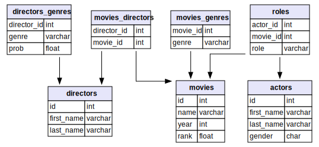

# IMDB

1888 年到 2008 年间的电影数据库。

## Source

1. [ilp_datasets](http://kt.ijs.si/janez_kranjc/ilp_datasets/)
2. [relational dataset repository](https://relational.fit.cvut.cz/dataset/IMDb)

## Models



具体每张表的内容描述如下：

| 表名             | 数据释义                           |
| ---------------- | ---------------------------------- |
| movies           | 电影信息，包含名称、上映年份及排名 |
| movies_genres    | 电影流派信息 (共 21 种)            |
| movies_directors | 电影导演                           |
| directors        | 导演信息                           |
| directors_genres | 导演流派                           |
| actors           | 演员信息                           |
| roles            | 电影角色及对应的演员信息           |

## Import

### MySQL

本机使用的是 MySQL 8.0.19

```shell
$ mysql -h 127.0.0.1 -P 3306 -uroot -v
...
Server version: 8.0.19 Homebrew
...
```

现在数据库中建库：

```sql
CREATE DATABASE imdb;
```

直接将 ilp_datasets 上下载的 imdb.sql 导入即可：

```shell
$ mysql -uroot -P 3306 imdb < imdb.sql
```

关注一下数据表的状态：

```sql
SHOW TABLE STATUS FROM `imdb`;

| Name   | Engine | ...
| actors | MyISAM | ...
...
```

发现存储引擎用的是 MyISAM，顺便再按 InnoDB 存一份：

```shell
# imdb.sql 本身有 148M，就不再复制一份
$ sed -i 's/MyISAM/InnoDB/g' imdb.sql
```

新建数据库 imdb_inno：

```sql
CREATE DATABASE imdb_inno;
```

导入数据：

```shell
$ mysql -uroot -P 3306 imdb_inno < imdb.sql
```

对比两个存储引擎存储的数据大小：

```sql
SELECT 
    table_schema 'Database Name',
    SUM(data_length) 'data length',
    SUM(index_length) 'index length',
    SUM(data_length + index_length) 'Size in Bytes',
    ROUND(SUM(data_length + index_length) / 1024 / 1024, 2) 'Size in MiB'
FROM information_schema.tables 
GROUP BY table_schema;

>
+--------------------+-------------+--------------+---------------+-------------+
| Database Name      | data length | index length | Size in Bytes | Size in MiB |
+--------------------+-------------+--------------+---------------+-------------+
| imdb               | 141871223   | 147978240    | 289849463     | 276.42      |
| imdb_inno          | 103497728   | 88309760     | 191807488     | 182.92      |
+--------------------+-------------+--------------+---------------+-------------+
```

### TiDB

本机使用的是 tidb 版本是 v3.0.2

```shell
$ tidb-server -V
Release Version: v3.0.2-dirty
```

导入方法与 MySQL 相同：

```shell
$ mysql -uroot -P 3306 imdb_inno < imdb.sql
```

导入数据后同样观察一下存储体积：

```sql
+--------------------+-------------+--------------+---------------+-------------+
| Database Name      | data length | index length | Size in Bytes | Size in MiB |
+--------------------+-------------+--------------+---------------+-------------+
| imdb_inno          | 140100040   | 147629704    | 287729744     | 274.40      |
+--------------------+-------------+--------------+---------------+-------------+
```

